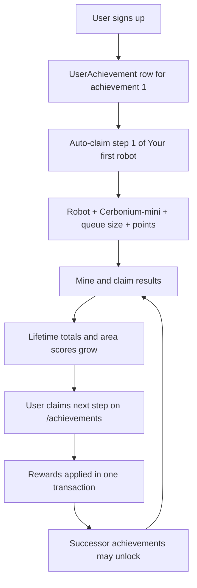

# Achievements

RoboMiner achievements are a stepped progression system. Players claim one step at a
time on the `/achievements` page. Claiming applies rewards (queue size, robots,
mining areas, wallet caps, achievement points) and can unlock successor
achievements.

Seed data lives in `resources/database/gameData.sql` (achievement section from line
~882). Runtime logic is in `robominer-db/src/achievements.rs`, exposed through
`robominer-domain` and `robominer-web`.

## Database model

| Table | Purpose |
| --- | --- |
| `Achievement` | Title and description for one achievement track. |
| `AchievementStep` | One step in a track: points, rewards, optional area/ore reward fields. |
| `AchievementStepMiningTotalRequirement` | Lifetime ore totals required before claim. |
| `AchievementStepMiningScoreRequirement` | Minimum best robot score in a mining area. |
| `AchievementPredecessor` | Unlock rule: successor becomes available after predecessor step N. |
| `UserAchievement` | Per-user progress: `stepsClaimed` for each unlocked achievement. |

### `AchievementStep` reward columns

| Column | Effect on claim |
| --- | --- |
| `achievementPoints` | Added to `User.achievementPoints`. |
| `miningQueueReward` | Added to `User.miningQueueSize`. |
| `robotReward` | If the user owns fewer robots than this value, a default robot is created. |
| `miningAreaId` | Inserts `UserMiningArea` (unlocks the area for queueing). |
| `oreId` + `maxOreReward` | Raises `UserOreAsset.maxAllowed` for that ore (never lowers it). |

Every seeded step awards **10 achievement points**.

### Wallet cap vs robot container

These are separate limits:

- **Wallet** (`UserOreAsset.maxAllowed`): how much ore you can hold for shop costs
  and queue fees. New players start at **5** per ore type
  (`robominer_db::INITIAL_ORE_WALLET_MAX`) when the first wallet row is
  created on claim or shop interaction.
- **Robot container** (`RobotPart.oreCapacity` on the ore container part): how
  much ore a robot carries during a rally.

Achievement `maxOreReward` only raises the **wallet** cap.

## How progress is measured

Requirements are checked at claim time against the **user's account**, aggregating
across all of that user's robots.

### Lifetime ore totals

`AchievementStepMiningTotalRequirement` compares against the sum of
`RobotLifetimeResult.amount` for the required `oreId`. This is **gross ore mined**
(before tax), accumulated when the user claims finished mining-queue results.

### Mining area scores

`AchievementStepMiningScoreRequirement` compares against the **maximum**
`RobotMiningAreaScore.score` any of the user's robots has reached in the given
`miningAreaId`. Scores are updated when rallies complete.

A step with **no** rows in either requirement table is claimable as soon as it is
the user's next step (for example the signup reward).

## Player lifecycle



### Signup

`robominer-db::create_user`:

1. Creates the `User` row (`miningQueueSize` starts at 0).
2. Inserts `UserAchievement(userId, achievementId=1, stepsClaimed=0)`.
3. Immediately claims achievement **1 / step 1** (no requirements).

That first claim gives a new player their starter robot, access to
**Cerbonium-mini** (area `1001`), +1 mining queue slot, and 10 achievement points.

### Claiming later steps

The user (or the achievements page) calls `claim_achievement_step` with `userId`
and `achievementId`. The engine:

1. Locks the `UserAchievement` row.
2. Loads step `stepsClaimed + 1`.
3. Verifies all mining-total and mining-score requirements.
4. Increments `stepsClaimed`.
5. Applies step rewards to `User`, `UserMiningArea`, `UserOreAsset`, and robots.
6. Unlocks any successor achievements whose predecessor steps are now satisfied.

Rejections: unknown achievement for user, no next step, or requirements not met.

### Unlocking successor achievements

`AchievementPredecessor` links `(predecessorId, predecessorStep) → successorId`.
When a step is claimed, each successor is evaluated: **all** predecessor links
pointing at that successor must be satisfied (`stepsClaimed >= predecessorStep`
on each listed predecessor). Matching successors get a `UserAchievement` row
with `stepsClaimed = 0` (`INSERT IGNORE`).

The same check also runs when achievement data is loaded for the achievements
page or app-shell claim badge, so players who already claimed a predecessor
step still unlock successors if an `AchievementPredecessor` row is added later.

A player only sees achievements present in `UserAchievement`. Locked tracks do not
appear until unlocked.

## Current seed catalog

The achievement section in `gameData.sql` currently defines **four** tracks.
Many mining areas exist in seed data (Lithabine-1, Neudralion-1, …) but are **not**
unlocked by achievements yet — only the areas listed in the tables below are
achievement-gated today.

Ore IDs: 1 Cerbonium, 2 Oxaria, 3 Lithabine, 4 Neudralion, 5 Complatix, 6 Prantum,
7 Raxia, 8 Dipolir, 9 Asradon, 10 Baratiem, 11 Etaxy.

| ID | Title | Steps | Unlocked after |
| --- | --- | ---: | --- |
| 1 | Your first robot | 1 | Signup (automatic) |
| 2 | Cerbonium Mastery | 10 | Achievement 1 step 1 |
| 3 | Oxaria Mastery | 1 | Achievement 2 step 7 |
| 99 | New robot | 1 | Achievement 2 step 10 |

### Achievement 1 — Your first robot

| Step | Requirements | Rewards |
| ---: | --- | --- |
| 1 | None | +10 points, +1 queue, +1 robot, unlock **Cerbonium-mini** (`1001`) |

### Achievement 2 — Cerbonium Mastery

Early tutorial track for Cerbonium areas, queue size, and Cerbonium wallet caps.

| Step | Requirements | Rewards |
| ---: | --- | --- |
| 1 | Mine **1** Cerbonium (lifetime gross) | +1 queue |
| 2 | Mine **20** Cerbonium | Cerbonium wallet cap → **20** |
| 3 | Score ≥ **70** in Cerbonium-mini (`1001`) | Unlock **Cerbonium-Starter** (`1002`) |
| 4 | Mine **50** Cerbonium | Cerbonium wallet cap → **50** |
| 5 | Mine **75** Cerbonium | +1 queue |
| 6 | Score ≥ **120** in Cerbonium-Starter (`1002`) | Unlock **Cerbonium-Advanced** (`1003`) |
| 7 | Mine **100** Cerbonium | Cerbonium wallet cap → **100** |
| 8 | Mine **500** Cerbonium; scores ≥ **150** in `1001`, `1002`, and `1003` | Cerbonium wallet cap → **500** |
| 9 | Mine **1 000** Cerbonium | Cerbonium wallet cap → **1 000** |
| 10 | Mine **5 000** Cerbonium; scores ≥ **200** in `1001`, `1002`, and `1003` | Cerbonium wallet cap → **5 000** |

### Achievement 3 — Oxaria Mastery

| Step | Requirements | Rewards |
| ---: | --- | --- |
| 1 | None (unlocked after Cerbonium Mastery step 7) | Unlock **Oxaria-Light** (`1101`) |

Further Oxaria area steps (`1102`, `1103`) exist in seed data but have no
achievement unlock rows yet.

### Achievement 99 — New robot

| Step | Requirements | Rewards |
| ---: | --- | --- |
| 1 | Mine **1 000** Lithabine (ore 3, lifetime gross) | Second robot (`robotReward = 2`) |

Unlocked after Cerbonium Mastery step 10.

## Unlock graph

```text
[1 Your first robot]
        │
        ▼
[2 Cerbonium Mastery]
        │
        ├──step 7──► [3 Oxaria Mastery]
        │
        └──step 10─► [99 New robot]
```

## Code and UI

| Layer | Location |
| --- | --- |
| Initial wallet cap | `robominer-db/src/initial_ore_wallet_max.rs` |
| Schema | `resources/database/createDatabase.sql` |
| Seed data | `resources/database/gameData.sql` |
| Claim + queries | `robominer-db/src/achievements.rs` |
| Rejection copy | `robominer-domain/src/rejection_messages.rs` |
| Web page | `robominer-web/src/achievements_page.rs` |
| Signup auto-claim | `robominer-db/src/users.rs` (`create_user`) |
| Engine CLI | `robominer-engine` achievement commands |

The achievements page shows, per unlocked track: steps completed, next step
rewards, ore-total progress bars, score progress per area, and whether the next
step is claimable. When no wallet row exists yet, the UI assumes the initial cap
of **5** for display.

## Editing achievement data

1. Change rows in `resources/database/gameData.sql`.
2. Re-run seed against the database:

   ```sh
   resources/scripts/init-ci-database.sh
   ROBOMINER_FORCE_DB_REINIT=1 resources/scripts/init-ci-database.sh
   ```

3. Existing `UserAchievement.stepsClaimed` values are not rolled back; plan
   migrations carefully if reducing step counts or tightening requirements.

When adding new tracks, remember to wire `AchievementPredecessor` rows so players
can discover them on the achievements page.
