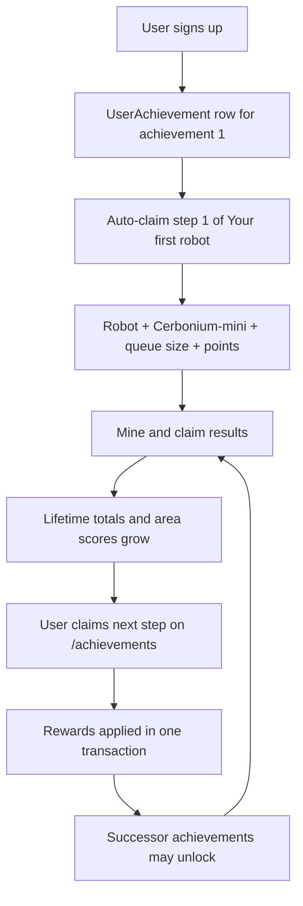

# Achievements

RoboMiner achievements are a stepped progression system. Players claim one step at a
time on the `/achievements` page. Claiming applies rewards (queue size, robots,
mining areas, wallet caps, achievement points) and can unlock successor
achievements.

Seed data lives in `resources/database/gameData.sql` (the `-- Achievements` section).
Runtime logic is in `robominer-db/src/achievements/`, exposed through
`robominer-domain` and `robominer-web`.

## Database model

| Table | Purpose |
| --- | --- |
| `Achievement` | Title and description for one achievement track. |
| `AchievementStep` | One step in a track: points, rewards, optional area/ore reward fields. |
| `AchievementStepMiningTotalRequirement` | Lifetime ore totals required before claim. |
| `AchievementStepMiningScoreRequirement` | Minimum best robot score in a mining area. |
| `AchievementStepDepotTotalRequirement` | Lifetime depot ore totals required before claim. |
| `AchievementPredecessor` | Unlock rule: successor becomes available after predecessor step N. |
| `UserAchievement` | Per-user progress: `stepsClaimed` for each unlocked achievement. |

### `AchievementStep` reward columns

| Column | Effect on claim |
| --- | --- |
| `achievementPoints` | Added to `User.achievementPoints`. |
| `miningQueueReward` | Added to `User.miningQueueSize`. |
| `robotReward` | If the user owns fewer robots than this value, a default robot is created. |
| `miningAreaId` | Inserts `UserMiningArea` (unlocks the area for queueing). |
| `oreId` + `maxOreReward` | Raises `UserOreAsset.maxAllowed` for that ore (never lowers it). |
| `oreId` + `maxDepotReward` | Raises `UserOreAsset.depotMaxAllowed` for that ore (never lowers it). |

Most seeded steps award **10** achievement points. Later mastery capstones award
**25**. The second- and third-robot tracks award **50**.

### Wallet cap vs robot container vs depot

These are separate limits:

- **Wallet** (`UserOreAsset.maxAllowed`): how much ore you can hold for shop costs
  and queue fees. New players start at **5** per ore type
  (`robominer_db::INITIAL_ORE_WALLET_MAX`) when the first wallet row is
  created on claim or shop interaction.
- **Robot container** (`RobotPart.oreCapacity` on the ore container part): how
  much ore a robot carries during a rally.
- **Depot** (`UserOreAsset.depotMaxAllowed`): how much of each ore type a robot
  can bank at its spawn cell by dumping during a rally. Starts at **0**; raised
  only by `maxDepotReward`. End-of-rally haul = depot + container.

Achievement `maxOreReward` only raises the **wallet** cap.
Achievement `maxDepotReward` only raises the **depot** cap.

## How progress is measured

Requirements are checked at claim time against the **user's account**, aggregating
across all of that user's robots.

### Lifetime ore totals

`AchievementStepMiningTotalRequirement` compares against the sum of
`RobotLifetimeResult.amount` for the required `oreId`. This is **gross ore mined**
(before tax), accumulated when the user claims finished mining-queue results.

### Mining area scores

`AchievementStepMiningScoreRequirement` compares against the **smoothed running**
`RobotMiningAreaScore.score` any of the user's robots has reached in the given
`miningAreaId`. Scores are updated when rallies complete. Comparison uses the
same one-decimal rounding as the achievements UI (`900.04` and `900.0` both
count as `900.0`), so a displayed tie meets the requirement.

### Lifetime depot totals

`AchievementStepDepotTotalRequirement` compares against the sum of
`MiningOreResult.depotAmount` on **claimed** mining-queue results for the
required `oreId`, aggregated across all of the user's robots. This is **gross
depot ore** (before tax), counted when the user claims finished mining-queue
results — the same timing as lifetime mined totals.

A step with **no** rows in any requirement table is claimable as soon as it is
the user's next step (for example the signup reward).

## Player lifecycle


```mermaid
flowchart TD
    signup[User signs up] --> ua[UserAchievement row for achievement 1]
    ua --> auto[Auto-claim step 1 of Your first robot]
    auto --> rewards[Robot + Cerbonium-mini + queue size + points]
    rewards --> mine[Mine and claim results]
    mine --> progress[Lifetime totals and area scores grow]
    progress --> claim[User claims next step on /achievements]
    claim --> apply[Rewards applied in one transaction]
    apply --> unlock[Successor achievements may unlock]
    unlock --> mine
```

### Signup

`robominer-db::create_user`:

1. Creates the `User` row (`miningQueueSize` starts at 0).
2. Inserts `UserAchievement(userId, achievementId=1, stepsClaimed=0)`.
3. Immediately claims achievement **1 / step 1** (no requirements).

That first claim gives a new player their starter robot, access to
**Cerbonium-mini** (area `1001`), +1 mining queue slot, and 10 achievement points.

### Claiming later steps

The user (or the achievements page) calls `claim_achievement_step` with `userId`
and `achievementId`. The engine:

1. Locks the `UserAchievement` row.
2. Loads step `stepsClaimed + 1`.
3. Verifies all mining-total, mining-score, and depot-total requirements.
4. Increments `stepsClaimed`.
5. Applies step rewards to `User`, `UserMiningArea`, `UserOreAsset`, and robots.
6. Unlocks any successor achievements whose predecessor steps are now satisfied.

Rejections: unknown achievement for user, no next step, or requirements not met.

### Unlocking successor achievements

`AchievementPredecessor` links `(predecessorId, predecessorStep) → successorId`.
When a step is claimed, each successor is evaluated: **all** predecessor links
pointing at that successor must be satisfied (`stepsClaimed >= predecessorStep`
on each listed predecessor). Matching successors get a `UserAchievement` row
with `stepsClaimed = 0` (`INSERT IGNORE`).

The same check also runs when achievement data is loaded for the achievements
page or app-shell claim badge, so players who already claimed a predecessor
step still unlock successors if an `AchievementPredecessor` row is added later.

A player only sees achievements present in `UserAchievement`. Locked tracks do not
appear until unlocked.

## Current seed catalog

The achievement section in `gameData.sql` currently defines **14** tracks. Every
mining area in seed data is unlocked by at least one achievement step. Full
per-step score, total, and depot gates live in that SQL; the tables below are
the index plus the early-game Cerbonium and robot tracks.

Ore IDs: 1 Cerbonium, 2 Oxaria, 3 Lithabine, 4 Neudralion, 5 Complatix, 6 Prantum,
7 Raxia, 8 Dipolir, 9 Asradon, 10 Baratiem, 11 Etaxy.

| ID | Title | Steps | Unlocked after |
| --- | --- | ---: | --- |
| 1 | Your first robot | 1 | Signup (automatic) |
| 2 | Cerbonium Mastery | 12 | Achievement 1 step 1 |
| 3 | Oxaria Mastery | 12 | Achievement 2 step 7 |
| 4 | Lithabine Mastery | 12 | Achievement 3 step 6 |
| 5 | Neudralion Mastery | 12 | Achievement 4 step 4 |
| 6 | Second robot | 1 | Achievement 5 step 5 |
| 7 | Complatix Mastery | 12 | Achievement 5 step 5 |
| 8 | Prantum Mastery | 12 | Achievement 7 step 5 |
| 9 | Raxia Mastery | 12 | Achievement 8 step 5 |
| 10 | Dipolir Mastery | 12 | Achievement 9 step 5 |
| 11 | One more robot | 1 | Achievement 10 step 1 |
| 12 | Asradon Mastery | 12 | Achievement 10 step 5 |
| 13 | Baratiem Mastery | 12 | Achievement 12 step 5 |
| 14 | Etaxy Mastery | 12 | Achievement 13 step 5 |

### Achievement 1 — Your first robot

| Step | Requirements | Rewards |
| ---: | --- | --- |
| 1 | None | +10 points, +1 queue, +1 robot, unlock **Cerbonium-mini** (`1001`) |

### Achievement 2 — Cerbonium Mastery

Early track for Cerbonium areas, queue size, wallet caps, and depot capacity.

| Step | Requirements | Rewards |
| ---: | --- | --- |
| 1 | Mine **1** Cerbonium | +1 queue |
| 2 | Mine **20** Cerbonium | Cerbonium wallet cap → **20** |
| 3 | Mine **25** Cerbonium; score ≥ **300** in Cerbonium-mini (`1001`) | Unlock **Cerbonium-Starter** (`1002`) |
| 4 | Mine **50** Cerbonium | Cerbonium wallet cap → **50**, depot cap → **5** |
| 5 | Mine **75** Cerbonium | +1 queue |
| 6 | Mine **100** Cerbonium; scores ≥ **500** in `1001` and ≥ **300** in `1002` | Unlock **Cerbonium-Advanced** (`1003`) |
| 7 | Mine **120** Cerbonium | Wallet cap → **100**, depot cap → **10**; unlocks Oxaria Mastery |
| 8 | Mine **200** Cerbonium; scores ≥ **700** / **500** / **450** in `1001` / `1002` / `1003` | Wallet cap → **500**, depot cap → **50** |
| 9 | Mine **500** Cerbonium | +1 queue |
| 10 | Mine **2 500** Cerbonium | Wallet cap → **1 000**, depot cap → **100** |
| 11 | Mine **5 000** Cerbonium; scores ≥ **800** in `1001`, `1002`, and `1003` | Wallet cap → **5 000**, depot cap → **500** |
| 12 | Mine **10 000** Cerbonium; depot **100** Cerbonium; scores ≥ **900** in `1001`, `1002`, and `1003` | +25 points, wallet cap → **9 999**, depot cap → **1 000** |

### Achievement 6 — Second robot

Unlocked after Neudralion Mastery step 5.

| Step | Requirements | Rewards |
| ---: | --- | --- |
| 1 | Mine **4 000** / **3 500** / **3 000** / **2 000** of ores 1–4; depot **100** of each; scores ≥ **900** in `1003`, `1103`, `1203` and ≥ **800** in `1302` | +50 points, second robot (`robotReward = 2`) |

### Achievement 11 — One more robot

Unlocked after Dipolir Mastery step 1.

| Step | Requirements | Rewards |
| ---: | --- | --- |
| 1 | Mine **30 000** / **25 000** / **15 000** / **6 000** of ores 5–8; depot **2 000** / **1 500** / **1 000** / **500**; scores ≥ **900** in `1402`, `1502`, `1602` and ≥ **800** in `1701` | +50 points, third robot (`robotReward = 3`) |

### Later mastery tracks

Each remaining track follows the same pattern: step 1 unlocks the first area of
that ore, a middle step unlocks the larger area, and later steps raise wallet
caps, depot caps, queue size, and score gates. See `gameData.sql` for the
numeric requirements.

| ID | First area unlock | Later area unlocks |
| ---: | --- | --- |
| 3 Oxaria | Step 1 → Oxaria-Light (`1101`) | Step 4 → Advanced (`1102`); step 10 → Expert (`1103`) |
| 4 Lithabine | Step 1 → Lithabine-Small (`1201`) | Step 4 → Medium (`1202`); step 8 → Large (`1203`) |
| 5 Neudralion | Step 1 → Neudralion-Small (`1301`) | Step 4 → Large (`1302`) |
| 7 Complatix | Step 1 → Complatix-Small (`1401`) | Step 4 → Large (`1402`) |
| 8 Prantum | Step 1 → Prantum-Small (`1501`) | Step 4 → Large (`1502`) |
| 9 Raxia | Step 1 → Raxia-Small (`1601`) | Step 4 → Large (`1602`) |
| 10 Dipolir | Step 1 → Dipolir-Small (`1701`) | Step 4 → Large (`1702`) |
| 12 Asradon | Step 1 → Asradon-Small (`1801`) | Step 4 → Large (`1802`) |
| 13 Baratiem | Step 1 → Baratiem-Small (`1901`) | Step 4 → Large (`1902`) |
| 14 Etaxy | Step 1 → Etaxy-Small (`2001`) | Step 4 → Large (`2002`) |

## Unlock graph

```text
[1 Your first robot]
        │
        ▼
[2 Cerbonium Mastery]
        │
        └──step 7──► [3 Oxaria Mastery]
                          │
                          └──step 6──► [4 Lithabine Mastery]
                                            │
                                            └──step 4──► [5 Neudralion Mastery]
                                                              │
                                                              ├──step 5──► [6 Second robot]
                                                              └──step 5──► [7 Complatix Mastery]
                                                                                │
                                                                                └──step 5──► [8 Prantum Mastery]
                                                                                                  │
                                                                                                  └──step 5──► [9 Raxia Mastery]
                                                                                                                    │
                                                                                                                    └──step 5──► [10 Dipolir Mastery]
                                                                                                                                      │
                                                                                                                                      ├──step 1──► [11 One more robot]
                                                                                                                                      └──step 5──► [12 Asradon Mastery]
                                                                                                                                                        └──step 5──► [13 Baratiem Mastery]
                                                                                                                                                                          └──step 5──► [14 Etaxy Mastery]
```

## Code and UI

| Layer | Location |
| --- | --- |
| Initial wallet cap | `robominer-db/src/initial_ore_wallet_max.rs` |
| Schema | `resources/database/createDatabase.sql` |
| Seed data | `resources/database/gameData.sql` |
| Claim + queries | `robominer-db/src/achievements/` |
| Rejection copy | `robominer-domain/src/rejection_messages.rs` |
| Web page | `robominer-web/src/achievements_page/` |
| Signup auto-claim | `robominer-db/src/users.rs` (`create_user`) |
| Engine CLI | `robominer-engine` achievement commands |

The achievements page shows, per unlocked track: steps completed, next step
rewards, ore-total progress bars, score progress per area, and whether the next
step is claimable. When no wallet row exists yet, the UI assumes the initial cap
of **5** for display.

## Editing achievement data

1. Change rows in `resources/database/gameData.sql`.
2. Re-run seed against the database:

   ```sh
   resources/scripts/init-ci-database.sh
   ROBOMINER_FORCE_DB_REINIT=1 resources/scripts/init-ci-database.sh
   ```

3. Existing `UserAchievement.stepsClaimed` values are not rolled back; plan
   migrations carefully if reducing step counts or tightening requirements.

When adding new tracks, remember to wire `AchievementPredecessor` rows so players
can discover them on the achievements page.
