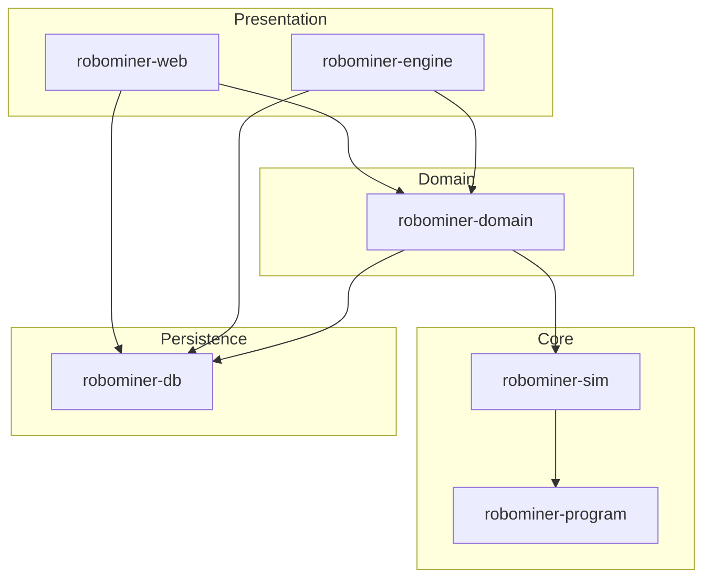
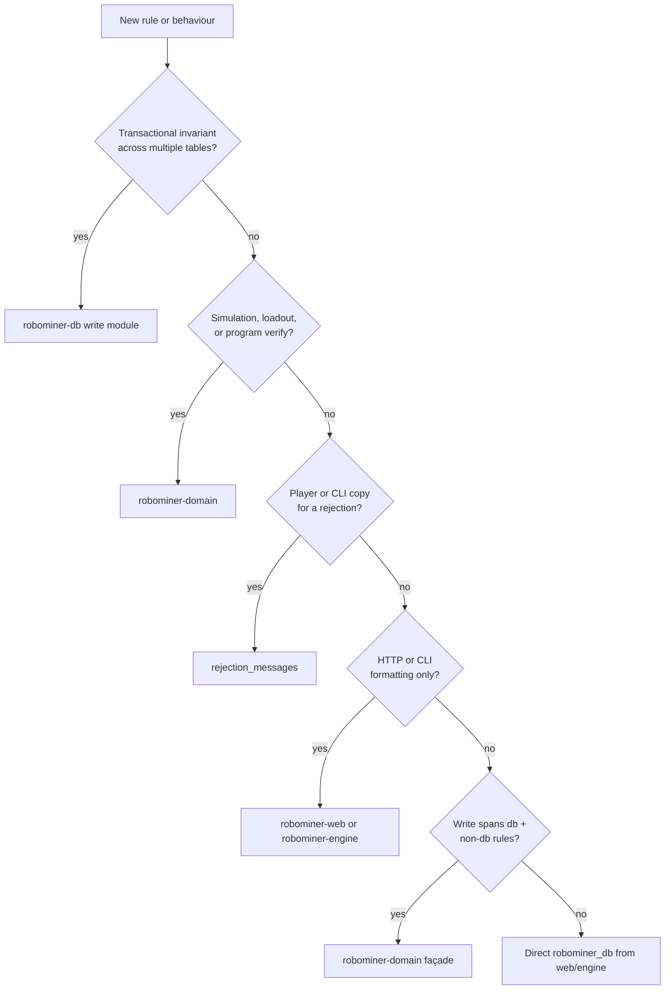

# RoboMiner architecture

RoboMiner is a Rust workspace for a browser-based mining game backed by MySQL. Presentation layers call persistence directly for CRUD and route simulation-heavy work through the domain crate.

## Crate layers

| Crate | Role |
| --- | --- |
| `robominer-program` | Robot language: parse, compile, interpret |
| `robominer-sim` | Mining physics, scoring, rally animation payloads |
| `robominer-db` | SQL, migrations, typed mutation contracts, read models, **and transactional game rules** |
| `robominer-domain` | Loadouts, simulation orchestration, program verify façades, rejection copy |
| `robominer-web` | Axum HTTP host, HTML pages, static assets |
| `robominer-engine` | CLI commands and background rally/mining worker |
| `robominer-optimize` | Offline genetic-algorithm tool (not on the production path) |
| `robominer-test-support` | Shared DB fixtures for integration tests |

Dependency direction is one-way: domain may depend on db; db must not depend on domain, sim, or program.

## Where does this rule live?

Use this decision tree when adding or changing game behaviour:

**Examples**

- Shop buy affordability and asset deduction → `robominer-db/src/shop/write.rs`
- Rally loadout assembly and simulation run → `robominer-domain/src/loadout/`, `simulation/`
- `"Unknown robot"` player string → `rejection_messages`, not db
- HTML page layout and form handling → `robominer-web`
- Shop buy / enqueue / account update → direct `robominer_db` from web/engine + `rejection_messages`
- Program create/update with compile verify → `robominer-domain` (`robot_config.rs`)

## HTTP routing and auth policy

Each `AppRoute` in `robominer-web/src/routes.rs` declares a `RoutePolicy`: `Public`,
`PublicRead` (optional session for HUD), or `SessionRequired { csrf_on_post }`. The router
(`router/route_policy.rs`) enforces policy before page handlers run and passes `PageSession`
to protected handlers.

## Rate limiting

Auth and mutation rate limiters in `robominer-web/src/rate_limit/` are in-memory and
process-local. They assume a single web instance (matching the systemd deployment in
`deploy/systemd/`). Scaling to multiple web processes would require an external store
(for example Redis) — that is a separate scaling initiative, not the current default.

## Typical request flows

**Shop buy (web):** browser POST → `robominer-web` handler → `robominer_db::buy_robot_part` → typed rejection mapped through `robominer_domain::rejection_messages`.

**Rally worker (engine):** `robominer_domain::load_next_rally_loadout_with_claim` → `run_rally_loadout_*` → `persist_rally_outcome`; SQL stays in `robominer-db`.

**Program save (web):** handler → `robominer_domain::update_program_source` (compile verify) → db persist helpers.

See [CONTRIBUTING.md](../CONTRIBUTING.md) for crate-boundary rules and the route-to-test matrix.

## Frontend assets

Page HTML is rendered in Rust (`*_page/render.rs`). Client behaviour lives under `robominer-web/static/js/` with Node tests colocated in `*/tests/`. Rally replay uses a shared viewer in `static/js/rally_animation/`; its JSON contract is documented in [animation-payload.md](animation-payload.md).

## Database

Fresh environments load `resources/database/createDatabase.sql` plus incremental migrations under `resources/database/migrations/`. Runtime migrations are embedded at build time in `robominer-db` (see `build.rs`).

## Further reading

- [CONTRIBUTING.md](../CONTRIBUTING.md) — tests, crate boundaries, error handling
- [docs/crate-map.md](crate-map.md) — module map for large crates
- [docs/gameData.md](gameData.md) — seed data structural map (`gameData.sql`)
- [docs/animation-payload.md](animation-payload.md) — rally replay JSON contract
- [AGENTS.md](../AGENTS.md) — cloud/dev environment notes
